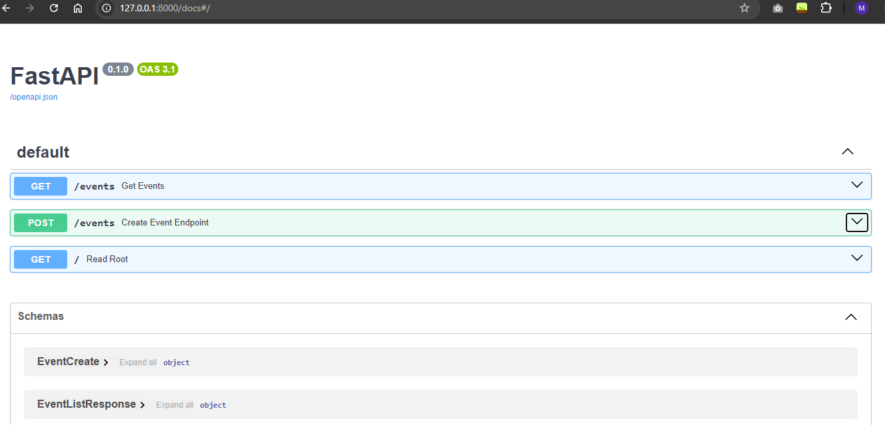
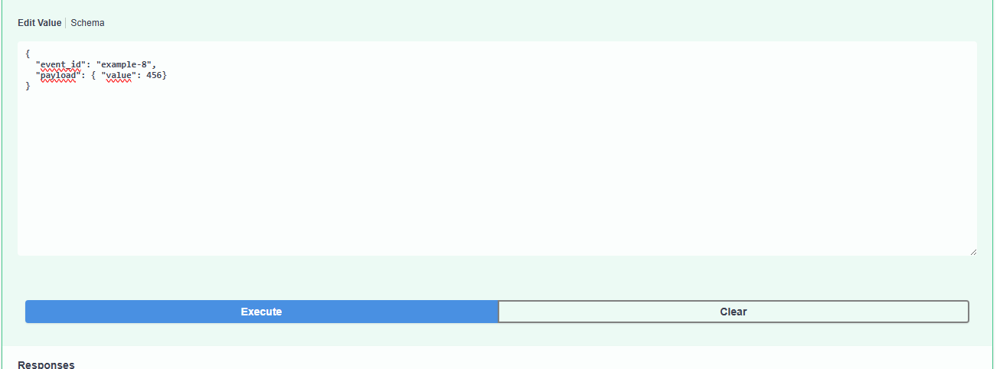
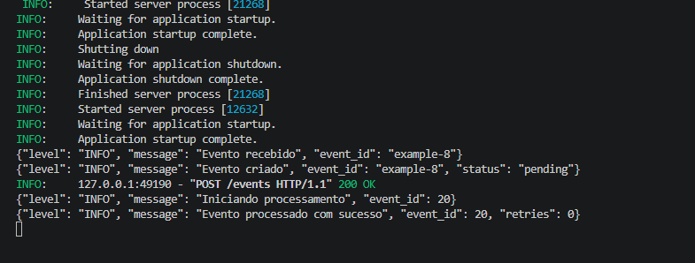
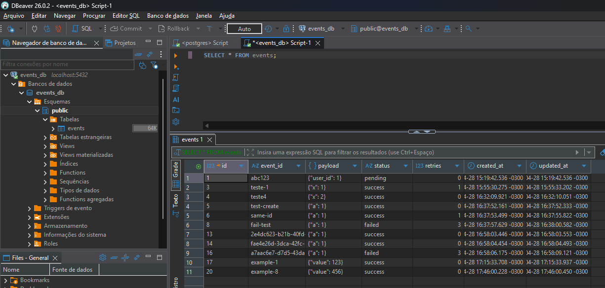
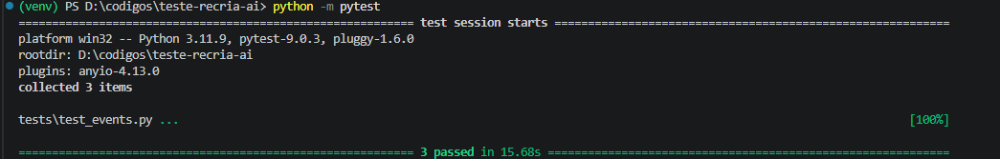

# Teste Recria AI

## 🚀 Mini API de Eventos Resilientes

## 📌 Visão geral

Este projeto implementa uma **API REST para ingestão e processamento de eventos**, seguindo boas práticas de backend com foco em:

* Idempotência (mesmo evento não é processado duas vezes)
* Processamento assíncrono
* Retry com backoff em caso de falha
* Paginação e filtros
* Logs estruturados
* Testes automatizados

A API foi desenvolvida com **FastAPI**, utilizando **PostgreSQL** como banco de dados.

---

## ⚙️ Como rodar o projeto

### 🔹 1. Clonar o repositório

```bash
git clone <url-do-repositorio>
cd <nome-do-projeto>
```

---

### 🔹 2. Subir o banco com Docker

```bash
docker-compose up -d
```

👉 Isso sobe o PostgreSQL automaticamente.

---

### 🔹 3. Criar e ativar o ambiente virtual

```bash
python -m venv venv
venv\Scripts\activate  # Windows
```

---

### 🔹 4. Instalar dependências

```bash
pip install -r requirements.txt
```

---

### 🔹 5. Rodar a API

```bash
uvicorn app.main:app --reload
```

---

### 🔹 6. Acessar documentação

```text
http://127.0.0.1:8000/docs
```

👉 Interface interativa (Swagger) para testar a API

---

## 📬 Endpoints principais

### 🔹 POST `/events`

Cria um evento:

```json
{
  "event_id": "abc123",
  "payload": { "valor": 100 }
}
```

✔ Idempotente (não duplica eventos)

---

### 🔹 GET `/events`

Lista eventos com:

* paginação (`page`, `size`)
* filtro por status (`status`)

Exemplo:

```text
/events?status=success&page=1&size=10
```

---

## 🧠 Decisões de arquitetura

### 🔹 Por que BackgroundTasks?

Foi utilizado `BackgroundTasks` do FastAPI para:

* Simplicidade de implementação
* Não exigir infraestrutura externa
* Atender ao requisito de processamento assíncrono

👉 Em cenários reais, o ideal seria usar:

* RabbitMQ
* Kafka
* Celery

---

### 🔹 Por que PostgreSQL?

* Banco robusto e amplamente utilizado
* Suporte a JSON (ideal para payloads)
* Fácil integração com SQLAlchemy
* Melhor representação de ambiente real

---

### 🔹 Idempotência

Garantida através de:

* `event_id` único no banco
* verificação antes da inserção

👉 Evita duplicação de eventos

---

### 🔹 Retry com backoff

* Até 3 tentativas
* Backoff incremental (1s, 2s, 3s)
* Em caso de falha total → status `failed`

---

### 🔹 Logs estruturados

Logs em formato JSON:

```json
{
  "level": "INFO",
  "message": "Evento criado",
  "event_id": "abc123"
}
```

👉 Facilita observabilidade e debug

---

## ⚠️ Limitações

* ❌ Não utiliza fila real (RabbitMQ, Kafka, etc.)
* ❌ Processamento assíncrono limitado ao processo da API
* ❌ Sem autenticação/autorização
* ❌ Sem deploy em cloud
* ❌ Sem controle avançado de concorrência

👉 Essas escolhas foram feitas para manter o escopo do desafio.

---

## 🧪 Testes

Foram implementados testes com **pytest** cobrindo:

### ✅ Criação de evento

* Verifica se o evento é persistido corretamente

### ✅ Idempotência

* Garante que o mesmo `event_id` não gera duplicação

### ✅ Retry e falha

* Simula falha no processamento
* Verifica retries e status final `failed`

---

### ▶️ Rodar testes

```bash
python -m pytest
```

---

## 🧹 Qualidade de código

Ferramentas utilizadas:

* **ruff** → linting
* **mypy** → tipagem estática

---

## 📦 O que ficou de fora

Por questões de escopo e tempo:

* Integração com fila real (Celery, RabbitMQ)
* Sistema de métricas (Prometheus)
* CI/CD
* Deploy em produção
* Testes com banco isolado

---

## 💡 Considerações finais

O projeto foi desenvolvido com foco em:

* Clareza
* Organização
* Boas práticas de backend
* Simulação de cenários reais (falha, retry, idempotência)

---

## Evidencias de execução

docker rodando:
[](./evidencias/ev1.png)

fastapi:
[](./evidencias/ev2.png)
[](./evidencias/ev3.png)
[](./evidencias/ev4.png)
[](./evidencias/ev5.png)

testes passaram
[](./evidencias/ev6.png)


## 👨‍💻 Autor

Marcus Vinícius Almeida Florêncio
